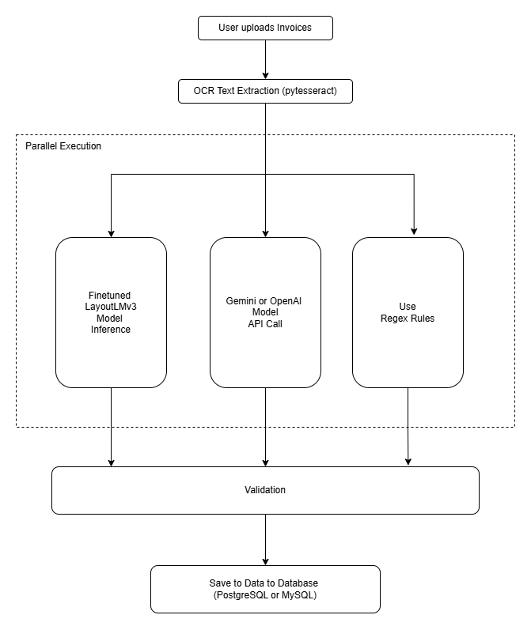

# ai-document-automation 

---

## Tech Stack & Tools
- Python
- REST APIs (Gemini or OpenAI)
- PostgreSQL
- pytesseract
- NLP 

## Project Pipeline

  

## TODO

> **Project Status:** Work in progress — ongoing development.